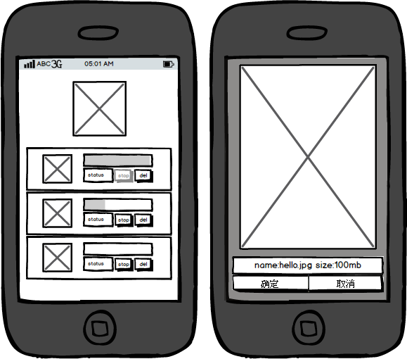

simple-mobile-web
=================

基于 jQuery 的 mobile web

除了 jQuery,没有使用其他第三方的库或者插件

支持最新版的 iPhone Safari 和 Android Google Chrome

## 功能：图片上传

1. 上传前预览图片

2. 每次选择一个图片,确定图片后加入图片列表

3. 能将图片从图片列表中删除

4. 加入图片列表后自动上传

5. 上传时显示上传进度和上传状态

6. 图片能被中止上传、重新上传

7. 当有图片正在上传时，其他讲图片列队等待

8. 中止上传后,若重新上传则加入到上传队列尾部

## 原型图

## 实际截图

